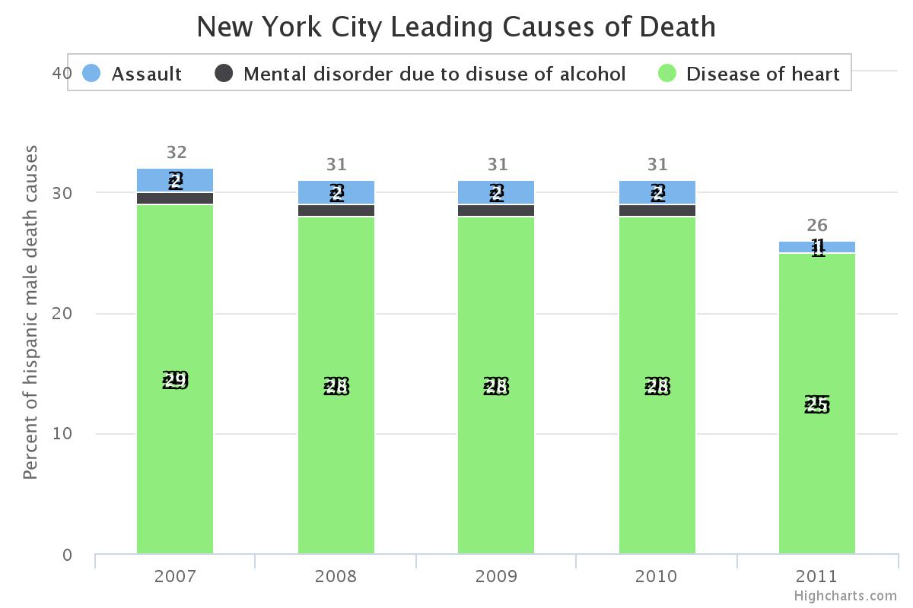

##10/25/16
###Siqi Liang
###Metrics + Data Visualization I

##INTRODUCTION
This chart is about New Yorker leading causes of death, i found this data from New York open data. And than i use Hichchart  to make the chart.I do not know how to import these into github, so i save this in the w3school as an image and attach the image in the github.

The raw data has already been categorized into many differnt classes, including years, enthniticy, sex,causes of death, counts and percents.I did not do all of them, i just pick 3 causes related to hispanic male, which i feel they are impact which each other. 

In the chart, the disears if heart is highest and the mental disorder due to disuse of alcohol is least, i do not know from medical perspective do these two things have some relationship. From 2007 to 2011, there is a decrease, each of them all has drop, i assume some policy had been applied during these years. 

I would like to include more than 3 elements and make some interaction like  Reuters Graphics, Journalism Deaths, but this is too much. 

<h2>Chart</h2>

